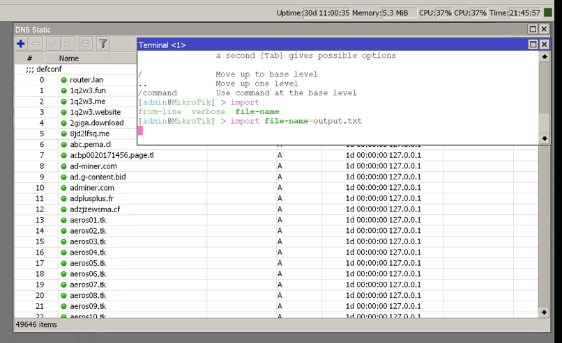

## From UI

Copy the output.txt in Files (router)

Open Terminal instance and type

```
[admin@MikroTik] > import file-name=output.tx
```

## From Terminal

```
scp output.txt robixxu@172.16.0.1:output.txt
```

or if you have this function defined

```
cprouter() {
  fileName=$(basename $1)
  scp $1 robixxu@172.16.0.1:$fileName
}
```

just call

```
cprouter output.txt
```

Then ssh into terminal and execute

```
[admin@MikroTik] > import file-name=output.tx
```

Profit


## ISSUE

It seems that there is a limiation.
Only 49650 items you can add

Another way to do this would be to generate regex from this list of domains(detect similar domains and generate regex) --- TODO
